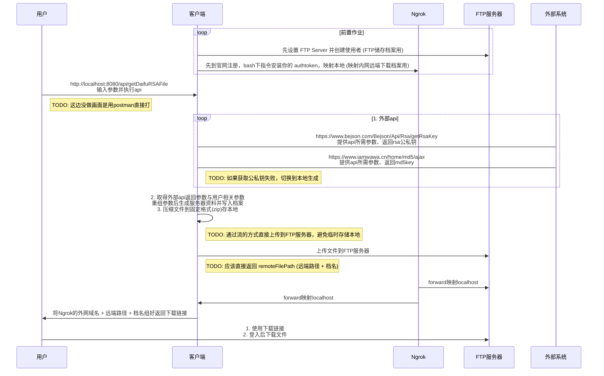

## Introduction

Spring boot FTP Ngrok
day5 (工作用) 快速产RSA服务器资料小工具

checkOrderKey.txt:
```
rsaThirdPubKey=MIGfMA0GCSqGSIb3DQEBAQUAA4GNADCBiQKBgQDE306UyfDhajLUeCy5P+82fJlAIuEnv9qL2+SLnbYnvVPNZsAWBPGGJeqtVqRhDsxG7mYarww7fR/U1hqKbA2UoLQTBMFDELPf/Hvoz1jPl+1COILgaRtVKgd6Z6XyDp5pfCIUhcmzXsQlaRhmSb9D8S3NtAtDlBJS30ulLikpywIDAQAB
rsaPrivateKey=MIICdgIBADANBgkqhkiG9w0BAQEFAASCAmAwggJcAgEAAoGBAM8L/FkgP2+3T7n7zHOfp9XNFv2mbYDGkzmUeqjMLMlEqq1nn9VpasxPWfFNZ6dnrD6TMCR9JiaDRGjp/1gW3crf5eXQL9M5xV8lXb2pmXwXTZRtTOkUdyGAG/+egx7N9+esYvrhYBV2kRqKccNRKc9MdC/LKri0oF6k363Xbw49AgMBAAECgYBnvWSqL3s5eYrL8Dsnr9ZDTOh5HRt+y4BW+GthCjRigDJYgjRWlOQ7DINPYW5PNaXbEJqtnbswztLHEn+rXoGvzzjK4mBiwSsMq6EvOYfw+fUQUfRWnossrVxhsD+S9RpOb6tWKErQ98SGX4j8htFH/GZAz5iAJUIPCUv/buzbLQJBAOh09TAz5djNSlswyxjiKpxJv3UbjeamkZvDClHjbS8b/GbpIvXbyrJBeDAufoGTsWOCkmvRcDh/CEJegzDAY48CQQDkBDUGxfoy80ezX4eW85/06gpRZfOt1/V2hgrluKPC+ewFHv0+I85CQsEDnUItZe5HQkt1zo3JQVqJjgw/OdtzAkByXjjUAnSvejF/ND54e63jPxWHlIr4VDOHoypMp8xsRSSlrUaaGA1eLn/nlLiBIB1CjFdl3KGN6lIx9TYuojlZAkEAi8Q4bMp2Lz0Iul7YUiNL7Wh4oqSH1gwGnnxTubSQTTe9APaZ7Lkt+VfJ0FlY81MD2BI/Bxtxteelg6PaxfbFGQJAbeRJhO+qFZj0OK1RI3UQvOOLeH+ktnZCQQm4NT1oBAo4V0I4+kE2jcornoaIyb4Si4Z/HpKNdJ10aarNN3YuwQ==
rsaPubKey=MIGfMA0GCSqGSIb3DQEBAQUAA4GNADCBiQKBgQDPC/xZID9vt0+5+8xzn6fVzRb9pm2AxpM5lHqozCzJRKqtZ5/VaWrMT1nxTWenZ6w+kzAkfSYmg0Ro6f9YFt3K3+Xl0C/TOcVfJV29qZl8F02UbUzpFHchgBv/noMezffnrGL64WAVdpEainHDUSnPTHQvyyq4tKBepN+t128OPQIDAQAB
md5Key=df84bf8cf4c44caeede3e10fcbe023ab
```

流程


## FTP 

Download FileZilla Client、FileZilla Server

https://filezilla-project.org/


教学看这两篇: 若要改成连到自己FTP 需要先设置 FTP Server 并创建使用者

https://blog.tarswork.com/post/filezilla-server-install-and-usage

https://blog.hungwin.com.tw/ftp-filezilla/

## Ngrok
ngrok 的转发（Forwarding）功能的确是让外网通过指定的 ngrok 地址（URL）访问你本地的服务。
例如，如果你在本地运行了一个服务在 localhost:8080，并通过 ngrok 创建了一个隧道，你会看到类似这样的输出

```bash
ngrok http 80
Forwarding                    http://abcd1234.ngrok.io -> http://localhost:8080
```

意味着外网用户可以通过访问 http://abcd1234.ngrok.io 来连接到你本地的 http://localhost:8080 服务。

1. ERROR:  authentication failed: Usage of ngrok requires a verified account and authtoken.
ngrok 要求你使用已验证的帐户和 authtoken。

```bash
# 安装你的 authtoken
ngrok authtoken YOUR_AUTHTOKEN
```

2. ERROR:  authentication failed: Your account is limited to 1 simultaneous ngrok agent sessions.
Using these methods,terminate an ngrok session when it is no longer needed.

```bash
curl http://127.0.0.1:4040/api/tunnels
# {"tunnels":[{"name":"command_line","ID":"bf59.....
curl -X DELETE http://127.0.0.1:4040/api/tunne"ID":"bf59ls/{tunnel_name}
```

## curl

```bash
curl -X POST http://localhost:8080/api/getDaifuRSAFile \
-H "Content-Type: application/json" \
-d '{
    "rsaThirdPubKey": "MIGfMA0GCSqGSIb3DQEBAQUAA4GNADCBiQKBgQDE306UyfDhajLUeCy5P+82fJlAIuEnv9qL2+SLnbYnvVPNZsAWBPGGJeqtVqRhDsxG7mYarww7fR/U1hqKbA2UoLQTBMFDELPf/Hvoz1jPl+1COILgaRtVKgd6Z6XyDp5pfCIUhcmzXsQlaRhmSb9D8S3NtAtDlBJS30ulLikpywIDAQAB",
    "daifuId": "daifu005",
    "merchantNo": "70153"
}'

curl -X POST http://localhost:8080/api/getDaifuRSAFile \
-H "Content-Type: application/json" \
-d '{
	"rsaLength": "4012",
	"rsaFormat": "PKCS#8",
	"rsaThirdPubKey": "MIGfMA0GCSqGSIb3DQEBAQUAA4GNADCBiQKBgQDE306UyfDhajLUeCy5P+82fJlAIuEnv9qL2+SLnbYnvVPNZsAWBPGGJeqtVqRhDsxG7mYarww7fR/U1hqKbA2UoLQTBMFDELPf/Hvoz1jPl+1COILgaRtVKgd6Z6XyDp5pfCIUhcmzXsQlaRhmSb9D8S3NtAtDlBJS30ulLikpywIDAQAB",
	"daifuId": "daifu001",
	"merchantNo": "70012"
}'
```

/api/getDaifuRSAFile Body:
```json
{
    "fileName": "https://b7eb-2001-b400-e450-e110-4474-5d24-6ac8-a246.ngrok-free.app/api/ftp_files/daifu005.zip",
    "message": "File uploaded successfully"
}
```

download ftp file use ngrok forwarding address: 依当下forward为主

```bash
curl -OJL -X GET https://b7eb-2001-b400-e450-e110-4474-5d24-6ac8-a246.ngrok-free.app/api/ftp_files/daifu005.zip
```
